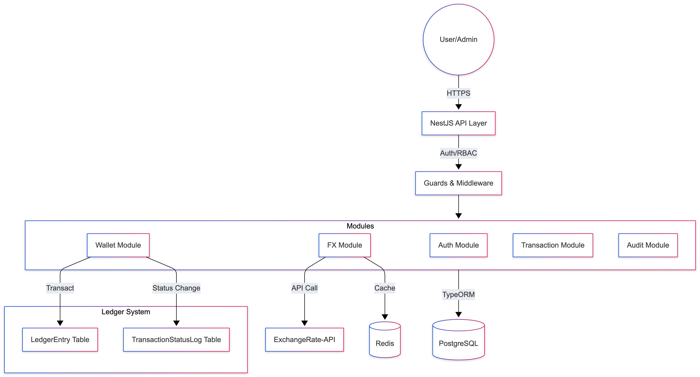
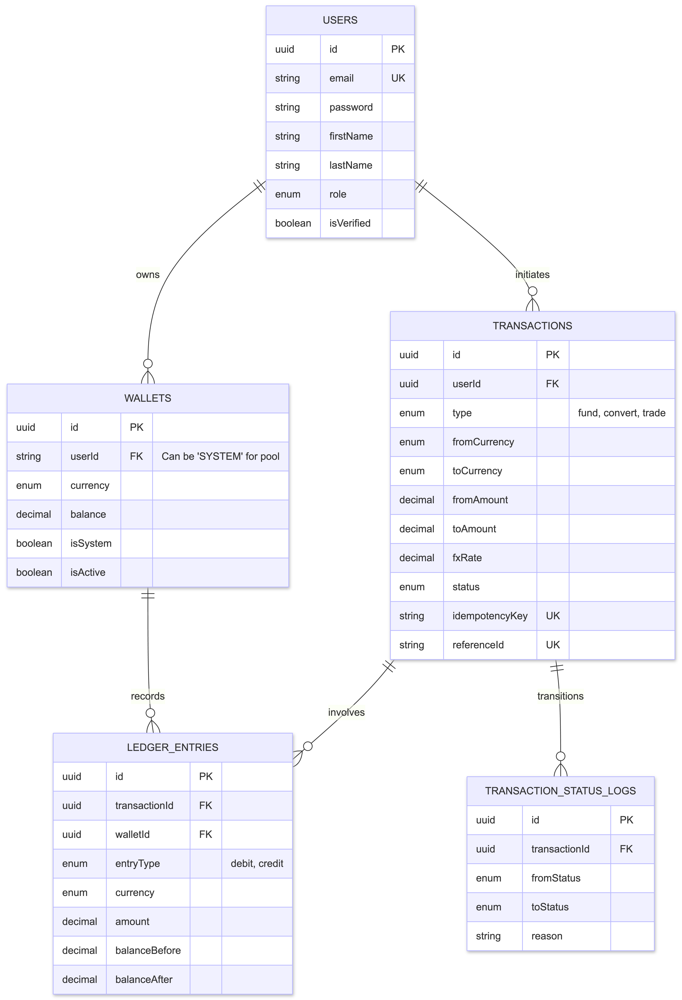

# System Architecture & Database Schema

## High-Level Architecture
The system follows a modular monolith architecture using NestJS, emphasizing separation of concerns and data integrity.

## Database Schema (ERD)

## Double-Entry Logic
Every financial movement involves at least two `LedgerEntry` records to ensure the total system balance remains consistent.
- **Funding**: Credits User Wallet and **Debits System Pool Wallet**.
- **Conversion**: Debits User Wallet (Source) and Credits User Wallet (Target).
- **Idempotency**: Checked inside the database transaction using `SERIALIZABLE` isolation to prevent race conditions.
